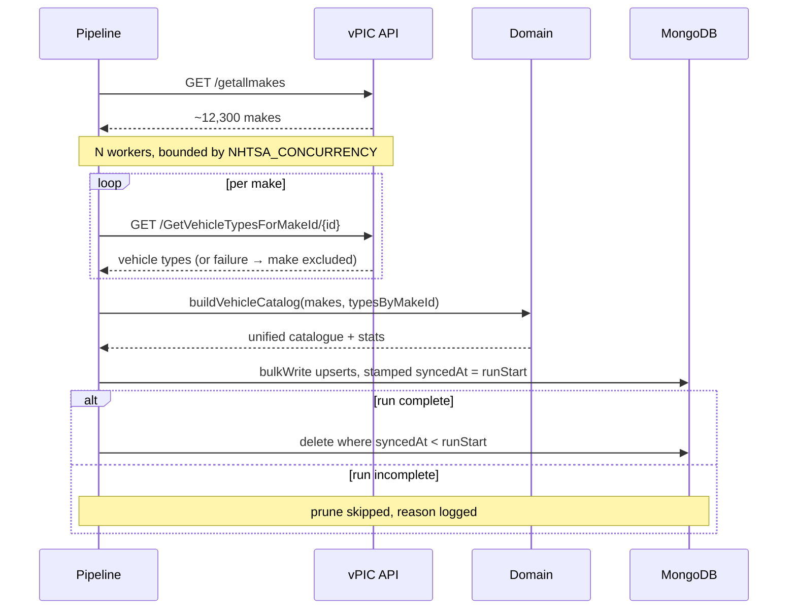

# Cars-api

A backend service that ingests vehicle data from the public [NHTSA vPIC](https://vpic.nhtsa.dot.gov/api/)
XML API, transforms it into JSON, persists it in MongoDB and serves it through a
single GraphQL endpoint.

[](https://github.com/RonSteeven/cars-api/actions/workflows/ci.yml)

> **Status:** feature complete and covered end to end. XML ingestion,
> transformation, MongoDB persistence and the GraphQL endpoint all work, 275 tests
> run the whole chain against a real database, and every push is linted, typed,
> tested and built as a container image in [CI](#continuous-integration).
> Remaining work is expanded API documentation — see [Roadmap](#roadmap).

---

## Table of contents

- [Requirements](#requirements)
- [Quick start](#quick-start)
- [Running with Docker](#running-with-docker)
- [npm scripts](#npm-scripts)
- [Configuration](#configuration)
- [Project structure](#project-structure)
- [Data model](#data-model)
- [Persistence (MongoDB)](#persistence-mongodb)
- [GraphQL API](#graphql-api)
- [Error handling strategy](#error-handling-strategy)
- [Logging strategy](#logging-strategy)
- [Ingestion pipeline](#ingestion-pipeline)
- [Upstream integration (NHTSA vPIC)](#upstream-integration-nhtsa-vpic)
- [Testing](#testing)
- [Continuous integration](#continuous-integration)
- [Git workflow](#git-workflow)
- [Roadmap](#roadmap)

---

## Requirements

| Tool    | Version                                     |
| ------- | ------------------------------------------- |
| Node.js | >= 20.11 (24.x recommended, see `.nvmrc`)   |
| npm     | >= 10                                       |
| Docker  | >= 24 (optional, for the containerised run) |
| MongoDB | 8.x (provided by `docker compose`)          |

## Quick start

```bash
# 1. install dependencies (also installs the Husky git hooks)
npm install

# 2. create your local environment file
cp .env.example .env

# 3. start MongoDB only
docker compose up -d mongo

# 4. run the API in watch mode
npm run dev
```

The service is then available on <http://localhost:4000>:

```bash
curl http://localhost:4000/health/live
# {"status":"ok","version":"0.1.0","uptimeSeconds":3}
```

### Populating the datastore

**A fresh install has no data**, so `makes` returns `totalCount: 0` until you
ingest. Ingestion never runs implicitly — it is thousands of upstream requests,
so it is always an explicit choice.

```bash
# capped run, a few seconds — start here
INGEST_MAKE_LIMIT=200 npm run ingest

# the whole catalogue (~12,300 makes, several minutes)
npm run ingest
```

Then:

```bash
curl -s -X POST http://localhost:4000/graphql \
  -H 'content-type: application/json' \
  -d '{"query":"{ makes(limit: 2) { totalCount items { makeId makeName vehicleTypes { typeName } } } }"}'
```

Inside the compose stack, use the one-shot job instead:

```bash
docker compose run --rm ingest                            # capped at 200
INGEST_MAKE_LIMIT=0 docker compose run --rm ingest        # full catalogue
```

The alternative is `INGEST_ON_STARTUP=true`, which runs one pass in the
background after the server starts listening. `npm run ingest` is usually what
you want: it exits non-zero if the pass was incomplete, so a scheduler or CI step
can act on it.

## Running with Docker

The compose stack builds the production image and wires it to MongoDB. The API
waits for the database health check before it starts, so a cold `up` is safe.

```bash
docker compose up --build          # API on :4000, MongoDB on :27017
docker compose run --rm ingest     # populate the datastore (see above)
docker compose logs -f api
docker compose down                # add -v to drop the database volume
```

> **The compose stack runs `NODE_ENV=production`**, since it builds the production
> image. Two consequences worth knowing:
>
> - The Apollo sandbox **is** available at <http://localhost:4000/graphql> because
>   compose sets `GRAPHQL_INTROSPECTION=true`. Set it to `false` for a deployment
>   that should expose neither the schema nor the page.
> - Apollo's CSRF protection rejects a browser `GET` on `/graphql` with
>   `400 BAD_REQUEST` when no query is supplied. That is by design; use `POST` with
>   `content-type: application/json`, or the sandbox.

Build and run the image on its own:

```bash
docker build -t cars-api .
docker run --rm -p 4000:4000 --env-file .env cars-api
```

The image is multi-stage: dependencies and TypeScript compilation happen in
builder stages, and the runtime stage ships only production dependencies plus
`dist/`. It runs as the unprivileged `node` user under `tini`, so `SIGTERM`
reaches Node and the graceful shutdown path actually runs.

## npm scripts

| Script                  | What it does                                        |
| ----------------------- | --------------------------------------------------- |
| `npm run dev`           | Watch-mode server via `tsx`                         |
| `npm run build`         | Type-check and emit `dist/` (`tsconfig.build.json`) |
| `npm start`             | Run the compiled server from `dist/`                |
| `npm run ingest`        | One-shot ingestion pass, then exit                  |
| `npm run ingest:prod`   | Same, from the compiled `dist/`                     |
| `npm run typecheck`     | `tsc --noEmit` across sources and tests             |
| `npm run lint`          | ESLint (type-aware rules)                           |
| `npm run lint:fix`      | ESLint with `--fix`                                 |
| `npm run format`        | Prettier write                                      |
| `npm run format:check`  | Prettier check (used in CI)                         |
| `npm test`              | Vitest, single run                                  |
| `npm run test:watch`    | Vitest in watch mode                                |
| `npm run test:coverage` | Vitest with a V8 coverage report in `coverage/`     |

## Configuration

Configuration is environment based. Every variable is declared, coerced and
validated with **Zod** in [`src/config/env.schema.ts`](src/config/env.schema.ts),
then mapped onto a structured, read-only `AppConfig` object in
[`src/config/index.ts`](src/config/index.ts).

Three rules keep this honest:

1. **Validation happens once, at startup.** An invalid environment throws a
   `ConfigurationError` listing every offending variable and the process exits
   non-zero. The service never boots half-configured.
2. **`process.env` is read in exactly one module.** Everywhere else takes
   `AppConfig` as an injected dependency, which is also what makes the units
   testable without touching the real environment.
3. **Every variable has a working default.** A bare `npm run dev` against the
   compose stack needs no `.env` at all; `.env` only overrides.

`.env` is loaded with `dotenv` and never overrides variables already present in
the real environment, so container and CI settings always win.

### Environment variables

| Variable                     | Default                                   | Description                                                    |
| ---------------------------- | ----------------------------------------- | -------------------------------------------------------------- |
| `NODE_ENV`                   | `development`                             | `development` \| `test` \| `production`                        |
| `PORT`                       | `4000`                                    | TCP port the HTTP server binds to                              |
| `HOST`                       | `0.0.0.0`                                 | Bind interface (`0.0.0.0` is required inside containers)       |
| `SHUTDOWN_TIMEOUT_MS`        | `10000`                                   | Grace period for in-flight requests during shutdown            |
| `CORS_ORIGINS`               | `*`                                       | Comma separated allow-list, or `*` for any origin              |
| `LOG_LEVEL`                  | `info`                                    | `fatal`/`error`/`warn`/`info`/`debug`/`trace`/`silent`         |
| `LOG_PRETTY`                 | `false`                                   | Human readable log output (local development only)             |
| `MONGODB_URI`                | `mongodb://localhost:27017`               | MongoDB connection string                                      |
| `MONGODB_DB_NAME`            | `cars`                                    | Database name                                                  |
| `MONGODB_CONNECT_TIMEOUT_MS` | `10000`                                   | Connection timeout                                             |
| `NHTSA_BASE_URL`             | `https://vpic.nhtsa.dot.gov/api/vehicles` | Base URL of the vPIC API (override to point at a stub)         |
| `NHTSA_TIMEOUT_MS`           | `15000`                                   | Per-request timeout for outbound vPIC calls                    |
| `NHTSA_MAX_RETRIES`          | `3`                                       | Retry attempts for a failed vPIC request (exponential backoff) |
| `NHTSA_RETRY_BASE_DELAY_MS`  | `300`                                     | Base delay of the retry backoff                                |
| `NHTSA_CONCURRENCY`          | `8`                                       | Max concurrent vPIC requests during ingestion                  |
| `GRAPHQL_PATH`               | `/graphql`                                | Path the GraphQL endpoint is mounted on                        |
| `GRAPHQL_INTROSPECTION`      | on outside production                     | Force schema introspection on or off                           |
| `INGEST_ON_STARTUP`          | `false`                                   | Feature flag: run a full ingestion pass at startup             |
| `INGEST_MAKE_LIMIT`          | `0`                                       | Feature flag: cap makes ingested (`0` = no cap)                |

Booleans accept `true`/`false`, `1`/`0` and `yes`/`no`.

## Project structure

The layout follows a ports-and-adapters split: the domain sits in the middle and
knows nothing about HTTP, MongoDB or XML; infrastructure implements the ports the
domain declares; presentation exposes it all over the wire.

```
src/
├─ types/               # every interface and type alias, one file per context
│  ├─ app.ts            #   CreateAppOptions
│  ├─ config.ts         #   AppConfig, Env
│  ├─ error.ts          #   ErrorCode, AppErrorOptions
│  ├─ health.ts         #   HealthCheck, HealthCheckResult, HealthRouterOptions
│  ├─ http.ts           #   FetchLike, HttpClientOptions, HttpServerHandle
│  ├─ nhtsa.ts          #   NhtsaMake, NhtsaVehicleType, NhtsaResult
│  └─ vehicle.ts        #   Make, VehicleType, CatalogInput/Result/Stats
├─ utils/               # pure helpers, one file per context
│  ├─ array.ts          #   toArray
│  ├─ config.ts         #   parseCorsOrigins
│  ├─ error.ts          #   isAppError, toError
│  ├─ http.ts           #   sleep, backoffDelay, isRetryableStatus, parseRetryAfter
│  ├─ sort.ts           #   compareIds
│  ├─ text.ts           #   normalizeText
│  └─ vehicle.ts        #   collectVehicleTypes
├─ config/              # Zod env schema + config loader (only reader of process.env)
├─ domain/vehicles/     # catalogue transformation and validation schemas
├─ application/         # use cases: ingestion pipeline orchestration      (next branch)
├─ infrastructure/
│  ├─ http/             #   resilient outbound HTTP client
│  ├─ nhtsa/            #   vPIC adapter + upstream schemas
│  └─ xml/              #   XML parsing
├─ presentation/
│  └─ http/
│     ├─ app.ts         #   Express app factory (fully injected, no I/O on import)
│     ├─ middleware/    #   request logger, error handler
│     └─ routes/        #   health probes
├─ shared/              # logger, error classes, version
├─ server.ts            # socket binding + graceful close
└─ main.ts              # composition root: config → logger → app → lifecycle
tests/                  # integration tests and fixtures
```

Conventions worth knowing:

- **Types and helpers are centralised, split by context.** `types/` holds
  interfaces and type aliases only; `utils/` holds pure functions. Runtime
  classes stay with their module (error classes in `shared/errors.ts`, `HttpClient`
  in `infrastructure/http/`), because they are behaviour, not shape.
- **No side effects on import.** Modules export factories (`createApp`,
  `createLogger`, `startHttpServer`); only `main.ts` actually wires and starts
  anything. That is what lets the integration tests mount the app in-process.
- **Unit tests live next to their subject** (`src/utils/sort.test.ts`) while
  cross-layer tests live in `tests/`.
- **No barrel files.** Imports name the exact module, so a reader can see where
  a symbol comes from and the bundler never pulls in a whole folder.

## Data model

One aggregate: a **Make**, owning its **VehicleType**s. Defined in
[`src/domain/vehicles/vehicle.ts`](src/domain/vehicles/vehicle.ts).

| Field                     | Type            | Notes                                             |
| ------------------------- | --------------- | ------------------------------------------------- |
| `makeId`                  | `string`        | vPIC `Make_ID`. Unique; the natural key.          |
| `makeName`                | `string`        | vPIC `Make_Name`, whitespace-normalised.          |
| `vehicleTypes`            | `VehicleType[]` | Possibly empty. Unique by `typeId` within a make. |
| `vehicleTypes[].typeId`   | `string`        | vPIC `VehicleTypeId`.                             |
| `vehicleTypes[].typeName` | `string`        | vPIC `VehicleTypeName`, whitespace-normalised.    |

Serialised, that is exactly the contract:

```json
[
  {
    "makeId": "440",
    "makeName": "ASTON MARTIN",
    "vehicleTypes": [
      { "typeId": "2", "typeName": "Passenger Car" },
      { "typeId": "7", "typeName": "Multipurpose Passenger Vehicle (MPV)" }
    ]
  }
]
```

**Ids are strings, deliberately.** They are opaque keys we never do arithmetic
on, and `"0440"` must not become `440`. Types are embedded rather than
normalised into their own collection because they are always read with their
make, there are only a couple of dozen distinct ones, and a single document read
beats a join for the one query this service serves.

### Transformation rules

[`buildVehicleCatalog`](src/domain/vehicles/vehicle-catalog.ts) combines makes
with their types. It is pure and synchronous — no I/O, no clock, no config —
which is what lets the whole transformation be tested with object literals.

| Rule               | Behaviour                                                |
| ------------------ | -------------------------------------------------------- |
| Make with no types | Kept, with `vehicleTypes: []`                            |
| Duplicate `makeId` | First wins, rest counted as `duplicateMakes`             |
| Duplicate `typeId` | First wins, per make                                     |
| Invalid record     | Skipped and counted, never thrown on                     |
| Names              | Trimmed, internal whitespace collapsed; casing untouched |
| Ordering           | Makes and types sorted by id, numerically                |

Two of those carry real weight. **Ordering is numeric**, so make `99` precedes
make `1000`; deterministic output keeps upserts idempotent and makes a diff
between two runs meaningful. And **a run where every make fails validation
throws** rather than returning an empty catalogue — one bad row is noise, all of
them means the upstream contract changed, and an empty result would look like a
successful ingestion and wipe stored data.

Every run returns a `stats` block (`makesIn`, `makesOut`, `invalidMakes`,
`duplicateMakes`, `makesWithoutVehicleTypes`, `vehicleTypesOut`,
`invalidVehicleTypes`, `duplicateVehicleTypes`) so ingestion can report
"11,998 of 12,312" instead of losing the difference silently.

## Persistence (MongoDB)

One collection, `makes`, holding one document per make with its vehicle types
embedded. The repository
([`make.repository.ts`](src/infrastructure/persistence/mongo/make.repository.ts))
implements the `MakeRepository` **port** declared in
[`src/types/persistence.ts`](src/types/persistence.ts), so the application layer
depends on an interface and never on the MongoDB driver.

### Document shape

```js
{
  _id: "440",                    // the make id IS the primary key
  makeName: "ASTON MARTIN",
  vehicleTypes: [ { typeId: "2", typeName: "Passenger Car" } ],
  syncedAt: ISODate("...")       // storage-only, never served
}
```

**The make id is `_id`.** That single decision buys a unique index for free, makes
every upsert idempotent on the natural key, and removes any chance of two
concurrent runs storing the same make twice. `_id` is projected back onto
`makeId` on read, so `_id` and `syncedAt` never reach the API.

### Indexes

| Index                 | Purpose                                       |
| --------------------- | --------------------------------------------- |
| `_id`                 | Lookup by make id (automatic, unique)         |
| `makeName_ci`         | Sorted listings and name search               |
| `vehicleTypes_typeId` | Filter makes by vehicle type (multikey)       |
| `syncedAt`            | The prune step at the end of an ingestion run |

`makeName_ci` carries a collation (`locale: en, strength: 2`), which makes search
and ordering case-insensitive **without** storing a duplicate lowercased field.
Queries that use it pass the same collation, otherwise MongoDB silently ignores
the index.

### Writes

`upsertMany` chunks into `bulkWrite` batches of 1,000 with `ordered: false`.

- **Chunking** because MongoDB caps a batch at 100k operations and 16MB of BSON,
  and a 12,312-document catalogue as one batch is slow to acknowledge and
  all-or-nothing to retry.
- **`ordered: false`** so the server applies the rest of a batch after an
  individual failure. One bad document should not block the other 11,999.
- **`$set`, not replace**, so the write is idempotent: re-running an unchanged
  catalogue reports `inserted: 0` and leaves the data untouched.

### Removals

A make that disappears upstream has to disappear here too. Each run stamps
`syncedAt`, then `deleteStaleBefore(runStartedAt)` removes whatever it did not
touch. The caller must only prune **after a run that completed** — pruning on a
partial run would delete perfectly good data, which is why the repository takes
the timestamp as an argument rather than deciding for itself.

### Failure handling

Every driver error is wrapped in `PersistenceError` by a single `guard` helper,
so no caller ever sees a MongoDB error class. Startup connects to the database
_before_ opening the HTTP listener: a process that cannot reach MongoDB exits
non-zero rather than accepting traffic it cannot serve. Readiness runs a real
`ping`, so `GET /health/ready` reports `503` when the connection breaks:

```json
{ "status": "ok", "version": "0.1.0", "checks": [{ "name": "mongodb", "ok": true }] }
```

## GraphQL API

A **single endpoint** at `POST /graphql` (path configurable via `GRAPHQL_PATH`),
served by Apollo Server 5. The schema lives in
[`schema.ts`](src/presentation/graphql/schema.ts) as SDL with a description on
every type, field and argument — so introspection _is_ the API reference.

Outside production the Apollo sandbox is available in a browser at
<http://localhost:4000/graphql>.

### Schema

```graphql
type VehicleType {
  typeId: ID! # NHTSA type id, e.g. "2". Opaque, never numeric.
  typeName: String! # e.g. "Passenger Car"
}

type Make {
  makeId: ID! # NHTSA make id, e.g. "440"
  makeName: String! # e.g. "ASTON MARTIN"
  vehicleTypes: [VehicleType!]! # embedded; may be empty, never null
}

type MakeConnection {
  items: [Make!]! # this page, ordered by name (case-insensitive)
  totalCount: Int! # matches ignoring pagination; resolved lazily
  limit: Int!
  offset: Int!
  hasMore: Boolean!
}

input MakeFilter {
  search: String # case-insensitive substring, matched literally
  vehicleTypeId: ID # only makes producing this type
}

type Query {
  makes(filter: MakeFilter, limit: Int = 50, offset: Int = 0): MakeConnection!
  make(makeId: ID!): Make
  vehicleTypes: [VehicleType!]!
}
```

### Example queries

**The unified structure — exactly the shape the brief specifies:**

```graphql
{
  makes(limit: 2) {
    items {
      makeId
      makeName
      vehicleTypes {
        typeId
        typeName
      }
    }
  }
}
```

```json
{
  "data": {
    "makes": {
      "items": [
        {
          "makeId": "12858",
          "makeName": "#1 ALPINE CUSTOMS",
          "vehicleTypes": [{ "typeId": "6", "typeName": "Trailer" }]
        },
        {
          "makeId": "4877",
          "makeName": "1/OFF KUSTOMS, LLC",
          "vehicleTypes": [{ "typeId": "1", "typeName": "Motorcycle" }]
        }
      ]
    }
  }
}
```

**Paginate, with the total:**

```graphql
{
  makes(limit: 25, offset: 50) {
    totalCount
    hasMore
    items {
      makeId
      makeName
    }
  }
}
```

**Filter by name and vehicle type, using variables:**

```graphql
query FindMakes($filter: MakeFilter) {
  makes(filter: $filter, limit: 10) {
    totalCount
    items {
      makeId
      makeName
    }
  }
}
```

```json
{ "filter": { "search": "customs", "vehicleTypeId": "6" } }
```

**One make, and the distinct type list for a filter control:**

```graphql
{
  make(makeId: "440") {
    makeName
    vehicleTypes {
      typeName
    }
  }
  vehicleTypes {
    typeId
    typeName
  }
}
```

From a terminal:

```bash
curl -s -X POST http://localhost:4000/graphql \
  -H 'content-type: application/json' \
  -d '{"query":"{ makes(limit: 2) { totalCount items { makeId makeName vehicleTypes { typeName } } } }"}'
```

### Performance

Four deliberate choices, since the catalogue is ~12,300 makes:

1. **Pagination is not optional.** `limit` defaults to 50 and a request above
   **200** is _rejected_, not silently truncated — a client is never misled about
   what it received.
2. **`totalCount` is a lazy field resolver.** Counting matches is a second
   database query, so it runs only when the field is selected. Listing a page
   without it costs one read.
3. **No N+1.** Vehicle types are embedded in the make document, so
   `items { vehicleTypes { … } }` adds no per-make lookup. This is the payoff of
   embedding rather than normalising.
4. **Both filters are index-backed** — `makeName_ci` for search, the multikey
   `vehicleTypes.typeId` for type filtering.

### Errors

Errors follow the same taxonomy as the rest of the service, surfaced through
`extensions.code`:

```json
{
  "errors": [
    {
      "message": "limit must not exceed 200, received 500",
      "extensions": { "code": "BAD_REQUEST" }
    }
  ]
}
```

Operational errors keep their code and message. Client mistakes (`GRAPHQL_PARSE_FAILED`,
`GRAPHQL_VALIDATION_FAILED`, `BAD_USER_INPUT`) pass through as-is, since they are
the caller's problem. Anything unexpected is logged in full and returned as a bare
`INTERNAL_ERROR` — stack traces and error detail are never exposed in production,
and introspection is off there too.

A missing make returns `null` rather than an error: absence is a normal answer.

## Error handling strategy

Every deliberate failure extends `AppError`
([`src/shared/errors.ts`](src/shared/errors.ts)) and carries a stable `code`, an
HTTP `status`, an `isOperational` flag and a `context` bag.

| Error class                | Code                    | Raised when                                     |
| -------------------------- | ----------------------- | ----------------------------------------------- |
| `ConfigurationError`       | `CONFIGURATION_ERROR`   | The environment fails Zod validation at startup |
| `UpstreamUnavailableError` | `UPSTREAM_UNAVAILABLE`  | vPIC unreachable: DNS, reset, timeout           |
| `UpstreamBadResponseError` | `UPSTREAM_BAD_RESPONSE` | vPIC answered with an unusable status or body   |
| `XmlParseError`            | `XML_PARSE_ERROR`       | The payload is not well-formed XML              |
| `TransformationError`      | `TRANSFORMATION_ERROR`  | Parsed XML does not map onto the domain model   |
| `PersistenceError`         | `PERSISTENCE_ERROR`     | A MongoDB read or write failed                  |
| `NotFoundError`            | `NOT_FOUND`             | The requested resource or route does not exist  |
| `BadRequestError`          | `BAD_REQUEST`           | Caller input is invalid                         |

The distinction that matters is **operational vs. unexpected**:

- _Operational_ errors are anticipated (an upstream is down, a client asked for a
  missing record). They are logged at `warn`, keep their status code, and their
  message is safe to return to the caller.
- _Unexpected_ errors are bugs. They are logged at `error` with the full stack
  and surface as a generic `500 INTERNAL_ERROR` — internal details never leak in
  production, where message exposure is switched off.

A single Express error handler
([`middleware/error-handler.ts`](src/presentation/http/middleware/error-handler.ts))
is the only place an error becomes a response, and it is mounted last. Express 5
forwards rejected promises from async handlers to it automatically, so no route
needs its own try/catch. Error responses have a uniform shape:

```json
{ "error": { "code": "NOT_FOUND", "message": "Route not found: GET /nope", "requestId": "…" } }
```

At the process level, `unhandledRejection` and `uncaughtException` are logged at
`fatal` and trigger the same graceful shutdown as a `SIGTERM`, rather than
leaving the process in an unknown state.

## Logging strategy

Structured NDJSON logs via **Pino**, one line per event, no `console.*` anywhere
(the lint rule forbids it).

- **One root logger per process**, built from config in
  [`src/shared/logger.ts`](src/shared/logger.ts). Components derive children
  (`logger.child({ component: 'ingestion' })`) so context is consistent and
  queryable.
- **Every line carries** `service`, `env`, ISO-8601 `time`, a string `level`
  (rather than Pino's numeric default, which most aggregators mis-handle) and a
  message.
- **Request correlation:** `pino-http` attaches a child logger to each request
  with a request id, taken from an inbound `x-request-id` when present and
  generated otherwise. The id is echoed on the response and included in error
  bodies. Health probes are excluded from access logging unless they fail.
- **Level per outcome:** 5xx and thrown errors log at `error`, 4xx at `warn`,
  everything else at `info`.
- **Redaction:** `authorization`, `cookie`, passwords and connection strings are
  stripped before serialisation.
- **Lifecycle events** — startup (with the effective configuration), listening,
  shutdown reason and shutdown completion — are always logged.
- `LOG_PRETTY=true` swaps in `pino-pretty` for local work. Production always
  emits JSON to stdout, on the assumption the platform collects it.

## Ingestion pipeline

One pass is: **fetch → transform → persist → prune**, implemented as a single
use case in
[`ingest-vehicle-catalog.ts`](src/application/ingestion/ingest-vehicle-catalog.ts).



**Scale is the whole problem.** vPIC exposes vehicle types only per make, so a
complete pass is 1 + ~12,300 requests. That single fact drives every decision
below.

### Bounded concurrency

[`mapWithConcurrency`](src/utils/concurrency.ts) runs `NHTSA_CONCURRENCY` workers
pulling from a shared cursor — a worker pool, **not** batches. Batching
(`Promise.all` over slices of N) stalls every slice on its slowest item, and the
tail of 12,300 requests always contains a few that retry for seconds. Results are
returned in input order regardless of completion order, so the same input always
produces the same output.

### The two failure rules

These are the decisions most worth reviewing:

1. **A make whose vehicle-type request fails is excluded from the write entirely.**
   The tempting alternative — store it with `vehicleTypes: []` — would overwrite
   good stored data with a gap caused by a transient network error.

2. **Pruning only runs after a complete pass.** Deletion is driven by "untouched
   by this run", and a make excluded by rule 1 looks _identical_ to a make that
   disappeared upstream. Pruning after a partial pass would therefore delete
   perfectly good records. A run is complete only when nothing failed and nothing
   was aborted; a capped run (`INGEST_MAKE_LIMIT`) never prunes either, since
   everything beyond the cap would look stale.

A failed make list, by contrast, **rejects the whole run** — without it there is
nothing to ingest, and continuing would write an empty catalogue.

### Triggering

`INGEST_ON_STARTUP=true` fires one pass after the HTTP listener opens — _after_,
deliberately, because a pass takes minutes and readiness should not wait on it.
Failure is logged and the service keeps serving whatever is already stored.

`SIGTERM` aborts a run in flight. Shutdown then **drains** it before closing
MongoDB (bounded by `SHUTDOWN_TIMEOUT_MS`), so whatever was already gathered
still gets persisted and no bulk write is cut mid-flight.

`INGEST_MAKE_LIMIT=25` caps a run, which turns a multi-minute pass into a
~4-second one for local work.

### Observability

Every run logs a full report:

```json
{
  "makesFetched": 25,
  "makesSkippedUpstream": 0,
  "vehicleTypesSkippedUpstream": 0,
  "failedMakes": 0,
  "durationMs": 3681,
  "catalog": { "makesIn": 25, "makesOut": 25, "invalidMakes": 0, "duplicateMakes": 0 },
  "upserted": { "matched": 0, "modified": 0, "inserted": 25 },
  "pruned": 0,
  "pruneSkipped": true,
  "aborted": false
}
```

Every number answers a question someone asks when a run looks wrong. Re-running
an unchanged catalogue reports `inserted: 0`, which is the quickest way to
confirm the pass is idempotent.

## Upstream integration (NHTSA vPIC)

Two endpoints feed the catalogue:

| Call                         | Endpoint                                    | Returns                         |
| ---------------------------- | ------------------------------------------- | ------------------------------- |
| `getAllMakes()`              | `/getallmakes?format=XML`                   | ~12,300 makes                   |
| `getVehicleTypesForMake(id)` | `/GetVehicleTypesForMakeId/{id}?format=xml` | Vehicle types for a single make |

[`NhtsaClient`](src/infrastructure/nhtsa/nhtsa.client.ts) is the anti-corruption
layer: it owns the URLs, the XML and vPIC's `Make_ID`-style naming, and hands
back plain objects in our own vocabulary (`{ makeId, makeName }`). Nothing
outside `src/infrastructure/nhtsa` knows XML was involved.

**Resilience.** [`HttpClient`](src/infrastructure/http/http-client.ts) bounds
every request with an `AbortSignal` timeout and retries transient failures
(network errors, timeouts, `429`, `5xx`) with exponential backoff plus full
jitter, honouring a sane `Retry-After`. Permanent failures (`4xx`) fail fast.
The jitter is not decoration: the catalogue needs one request per make, so
without it a fleet of workers hitting the same `503` would retry in lockstep and
hammer the upstream in synchronised waves.

**Parsing.** [`parseXml`](src/infrastructure/xml/xml-parser.ts) validates before
parsing, because fast-xml-parser is lenient by default and would turn a
truncated response into silently missing records. Type coercion is switched off:
ids are opaque keys, the JSON contract we serve specifies strings, and
`<Make_ID>0440</Make_ID>` must not become the number `440`.

Three XML realities the client handles, all verified against live responses:

| Upstream reality                  | Parsed as    | Handled by |
| --------------------------------- | ------------ | ---------- |
| Many children                     | array        | `toArray`  |
| Exactly one child (most makes)    | bare object  | `toArray`  |
| `<Results />` for an unknown make | empty string | `toArray`  |

**Failure policy** splits envelope from record. A broken _envelope_ (not XML, no
`Response`, an HTML gateway page) throws — reporting "0 makes" there would look
like a successful empty ingestion and wipe the catalogue. A broken _record_
inside a valid envelope is logged and skipped, and the count is returned to the
caller as `skipped`, because one bad row in twelve thousand should not abort a
run, but silently losing it should never go unnoticed.

## Testing

[Vitest](https://vitest.dev) for both unit and integration tests, with V8
coverage.

```bash
npm test                 # single run
npm run test:watch       # watch mode
npm run test:coverage    # coverage report in coverage/
```

`tests/setup.ts` pins `NODE_ENV=test` and silences logs before any module loads,
so tests never inherit a developer's `.env`. HTTP tests drive the app in-process
with `supertest` — no port binding required.

### Three layers

| Layer           | Where                                              | Substitutes                              |
| --------------- | -------------------------------------------------- | ---------------------------------------- |
| **Unit**        | beside the source                                  | Everything external; pure functions only |
| **Integration** | `tests/persistence`, `tests/graphql`, `tests/http` | One real dependency at a time            |
| **End-to-end**  | `tests/e2e`                                        | Only the upstream API                    |

**Unit tests mock the boundary, not the logic.** The transformation, the retry
maths, the concurrency pool and the config schema are all pure, so they are tested
with object literals — no network, no database, no timers. `fetch` and `sleep` are
injected into the HTTP client, which is why 19 retry tests run in ~12ms instead of
30 seconds of real backoff.

**Repository tests run against a real MongoDB.** An in-memory fake would not
exercise collations, multikey indexes or `bulkWrite` semantics — precisely the
parts most likely to be wrong.

**End-to-end tests run the whole chain.** `tests/e2e` starts a local HTTP server
that serves genuine vPIC-shaped XML ([`vpic-stub.ts`](tests/helpers/vpic-stub.ts)),
points the real `HttpClient` at it, and then ingests → persists → queries over
GraphQL with `supertest`. Every layer is the real one; only NHTSA is substituted.
Mocking `fetch` instead would skip exactly what is most likely to break: XML
parsing, retry behaviour, index-backed queries.

That is what lets these be verified as behaviour rather than implementation:

- a transient `503` is retried and the make still lands
- a make whose types never arrive is excluded, and **previously stored types survive**
- pruning is skipped on an incomplete pass, even when makes really did vanish
- malformed XML for one make costs only that make
- a single-type make (which XML collapses to an object) still serves as an array
- re-ingesting is idempotent; a rename or a new type is picked up

Each suite gets its own `cars_test_*` database and drops it afterwards, so runs
cannot collide. When no server is reachable at `MONGODB_URI` the database-backed
suites are **skipped rather than failed**, so `npm test` still passes on a machine
without Docker while CI, which does run one, gets full coverage:

```bash
docker compose up -d mongo   # then npm test runs the integration and e2e suites too
```

## Continuous integration

[`.github/workflows/ci.yml`](.github/workflows/ci.yml) runs on every pull request
and every push to `main`. Four independent jobs, so one failure never hides
another and the whole thing finishes in parallel:

| Job                     | What it proves                                      | Artifact      |
| ----------------------- | --------------------------------------------------- | ------------- |
| **Lint, format, types** | ESLint, Prettier and `tsc --noEmit` are clean       | —             |
| **Tests (MongoDB 8)**   | 275 tests against a real database, with coverage    | `coverage/`   |
| **Build dist**          | `tsconfig.build.json` emits both entrypoints        | `dist/`       |
| **Docker image**        | the shipped image boots, reaches MongoDB and serves | image tarball |

Two details are the whole point of this pipeline:

**The test job refuses to let a skip pass for a pass.** The database-backed suites
skip themselves when nothing answers at `MONGODB_URI` — deliberate, so `npm test`
works without Docker, but in CI it would silently turn 55 integration and e2e
tests into a green no-op if the service container were slow. A `Wait for MongoDB`
step polls first and fails the job outright if the server never answers.

**The Docker job runs the image, not just `docker build`.** It starts the built
container against MongoDB, waits for `/health/ready` (which probes the datastore,
so a 200 means the container really reached it) and then POSTs a real GraphQL
query. A Dockerfile that compiles but ships a broken runtime — wrong `CMD`, a
missing production dependency, a permission the `node` user lacks — fails here
rather than in a deployment.

The image is exported as a build artifact rather than pushed to a registry;
publishing to GHCR is a `docker/login-action` step away when there is somewhere
to deploy it.

## Git workflow

- `main` is protected; every task ships on its own branch and merges via PR.
- Branch naming: `feat/…`, `fix/…`, `chore/…`, `docs/…`, `test/…`.
- **Husky pre-push hook** runs lint, type-check and the test suite. A failing
  hook blocks the push. Run `npm install` once to install it. It is the same gate
  as [CI](#continuous-integration), run early: the hook catches a failure in
  seconds locally instead of minutes into a pull request.

## Roadmap

| #   | Branch                       | Scope                                                            |
| --- | ---------------------------- | ---------------------------------------------------------------- |
| 1   | `chore/initial-setup`        | Tooling, config, logging, HTTP bootstrap, Docker ✅              |
| 2   | `feat/nhtsa-client`          | Resilient vPIC HTTP client + XML parsing ✅                      |
| 3   | `feat/domain-transformation` | Domain model and XML → JSON transformation, fully unit tested ✅ |
| 4   | `feat/mongo-persistence`     | MongoDB repository, indexes, bulk upserts ✅                     |
| 5   | `feat/ingestion-pipeline`    | Ingestion with bounded concurrency ✅                            |
| 6   | `feat/graphql-api`           | Single GraphQL endpoint ✅                                       |
| 7   | `test/integration`           | End-to-end ingestion → persistence → GraphQL ✅                  |
| 8   | `ci/github-actions`          | Lint, test, build, Docker image, artifacts ← **you are here**    |
| 9   | `docs/api-documentation`     | Pipeline docs, diagrams, GraphQL schema reference                |
